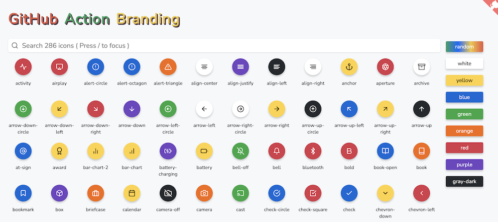
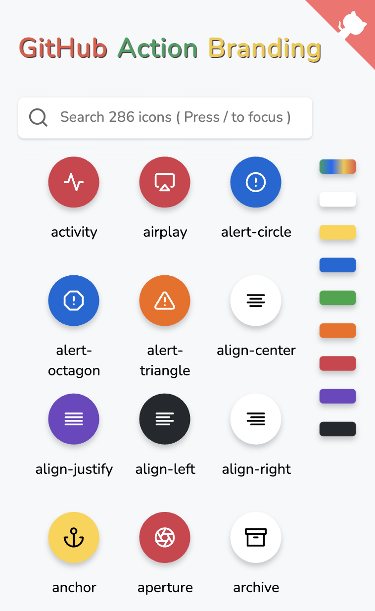

# 🌀 GitHub Action Branding

Quickly preview and select the [branding icon](https://docs.github.com/en/actions/creating-actions/metadata-syntax-for-github-actions#branding) used by github action.

## ✨ Preview

- https://actions-cool.github.io/github-action-branding/

---

## LICENSE

[MIT](./LICENSE)
